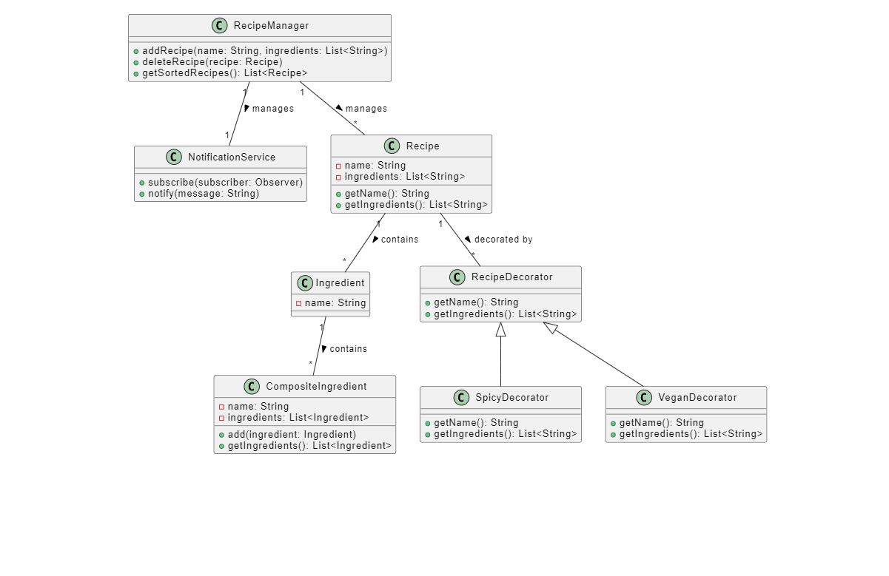
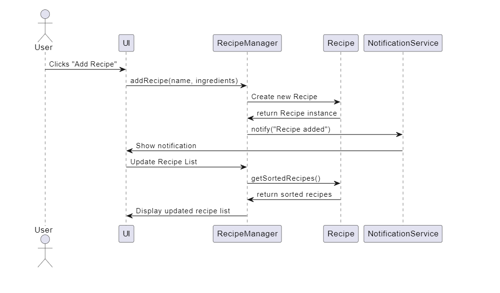

# Recipe Sharing Platform

## Overview

The **Recipe Sharing Platform** is a web application designed to allow users to create, manage, and share their favorite recipes. The platform implements various design patterns to enhance its architecture, maintainability, and usability.

## System Architecture Overview

This project utilizes the **Model-View-ViewModel (MVVM)** architectural pattern to separate the user interface logic from the business logic.

- **Model**: Manages the data of the application (e.g., recipes, user profiles) and includes data manipulation logic.
- **View**: Represents the UI components, built using HTML and Bootstrap for responsiveness.
- **ViewModel**: Acts as a bridge between the Model and View, handling user inputs and updating the View based on changes in the Model.

## Implemented Design Patterns

The application demonstrates the following design patterns:

### Creational Patterns:

- **Singleton**: Used for the `NotificationService` and `RecipeManager` to ensure a single instance manages notifications and recipes throughout the application.
- **Factory Method**: Implemented in the `RecipeFactory` for creating different variations of recipes (e.g., spicy, vegan).

### Structural Patterns:

- **Composite**: Used for handling ingredients, allowing a mix of individual and composite ingredients in a recipe, making it easier to manage complex ingredient structures.
- **Decorator**: Adds functionality to the `Recipe` class dynamically (e.g., adding spicy or vegan variations) without modifying the original class structure.

### Behavioral Patterns:

- **Observer**: Implemented for the notification system, where subscribers receive updates when recipes are added or deleted.
- **Strategy**: Used for sorting recipes by name or ingredient count, allowing dynamic changes in sorting behavior.

## UML Diagrams

The following UML diagrams illustrate the structure and interactions of the design patterns implemented in the project:

- Class Diagram: Represents the relationships between classes such as `Recipe`, `RecipeManager`, and `NotificationService`.
- Sequence Diagram: Demonstrates the flow of operations when a user adds a new recipe, highlighting the interaction between components.
  
### Class Diagram


### Sequence Diagram


## Usage Instructions

1. **Clone the Repository**:
   ```bash
   git clone https://github.com/MadiZhakenov/SDP-ENDTERM.git
   cd SDP-ENDTERM
   
2. **Open the Application**: 
   Open `index.html`, `recipes.html`, or `profile.html` in a web browser.

3. **Add/Manage Recipes**: 
   Use the interface to add new recipes, edit existing ones, or view your profile.

## Assumptions and Limitations

- The application is designed to work in modern web browsers. Compatibility with older browsers is not guaranteed.
- Recipes and user profiles are stored in the browser's local storage, which may limit access across different devices.
- The platform currently does not include user authentication or backend integration for persistent storage.

## Conclusion

This README provides a comprehensive overview of the **Recipe Sharing Platform**, detailing its architecture, implemented design patterns, and usage. For further information or contributions, please refer to the contributing guidelines or reach out to the project maintainers.

## License

This project is licensed under the **MIT License** - see the [LICENSE](LICENSE) file for details.
